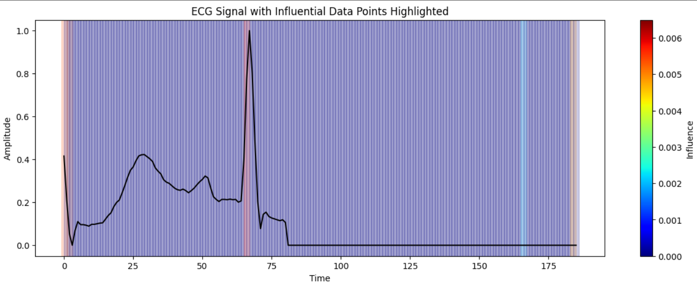
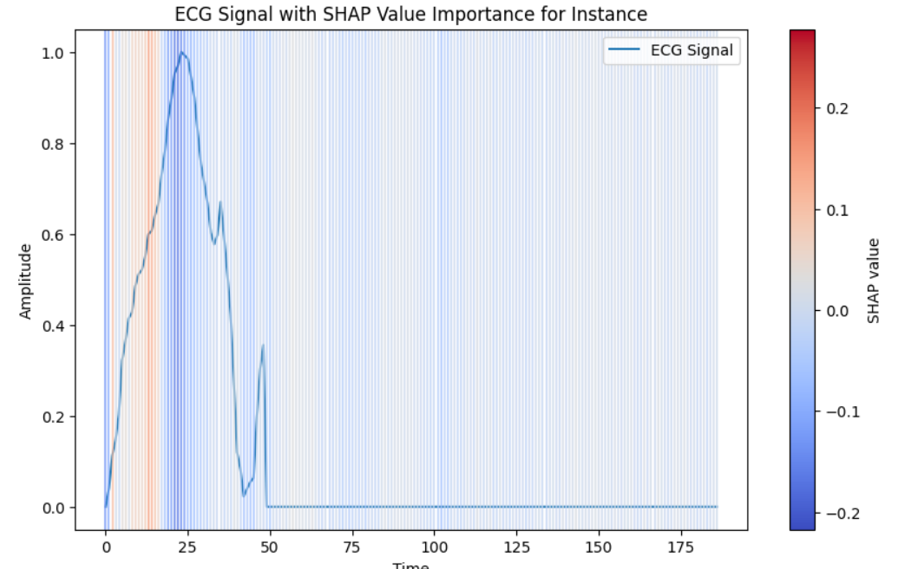

# model-xai

This repository is a branch of the BioSense AI organization, dedicated to developing an ECG classification device. The purpose of this repository is to conduct tests and experiments related to the interpretation of ECG models. By using various interpretation techniques, we aim to understand the decision-making process of our machine learning models better and ensure their reliability and transparency.

